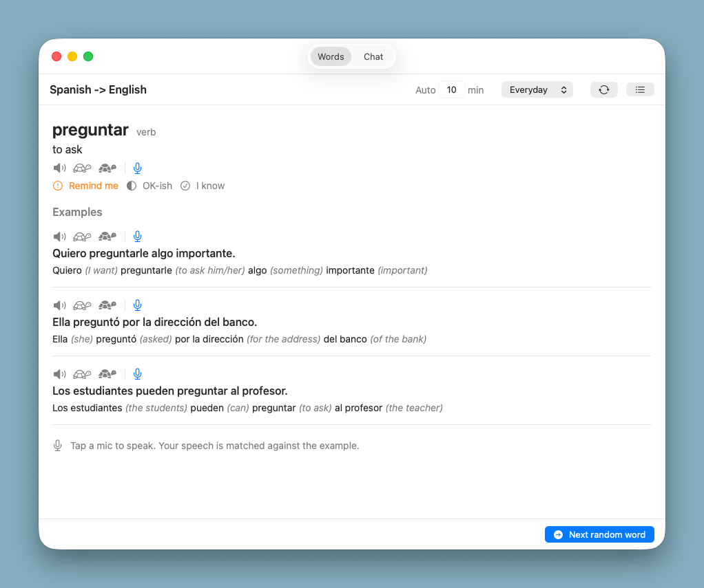

# Friendly Lang Tutor



A privacy-first macOS language tutor.
Think "LingoBar, but better": a local CLI agent does the language work, with real listening (TTS), speaking (STT), and pronunciation feedback.

Everything runs locally.
No account, no cloud, no tracking.

## What it does

* Picks a word, then has a local LLM generate fresh, varied example sentences for it, instead of pulling from a fixed database.
* Speaks the word and each sentence in the target language with on-device neural voices.
* Listens to you: you speak a word or sentence, it transcribes you, matches it against the example, tells you what you missed, and plays it back correctly.
* Tracks how well you know each word and how many times you have seen it.
* A separate Chat tab for short conversations in the target language.

## Two tabs

* **Words** - the current word with its article/gender, meaning, and three generated example sentences.
  Each sentence has speed controls (normal / slow / super-slow), a mic for pronunciation practice, and a segmented gloss (each chunk followed by its meaning in parentheses, in original word order; tap a chunk to hear just that chunk).
  "Next random word" advances; auto-advance every N minutes is optional.
  A style picker (`basic` / `everyday` / `fun` / `formal` / `expert`) and a regenerate button produce fresh variants.
  The list button opens an all-words browser.
* **Chat** - a free-form conversation with the tutor in the language you are learning.

## How it works

* **LLM** - a local CLI coding agent run headless, not a server or embedded model.
  Adapters ship for `claude` (default), `codex`, and `opencode`; pick one in Settings -> Engines.
  Word generation is a stateless one-shot per `(language pair, word, style)`; the result is parsed and cached.
* **STT** - shells out to the `whisper-cli` binary (Homebrew `whisper-cpp`).
  Models live in the shared `~/.cache/whisper-models`, reusing anything `srt`, OpenSuperWhisper, or other whisper tools already downloaded; it hardlinks OpenSuperWhisper's copy before falling back to a download.
* **TTS** - on-device neural Piper (VITS) voices via the `sherpa-onnx` CLI.
  The engine binary and voice models download on demand into `~/.cache/sherpa-tts`; Apple's `AVSpeechSynthesizer` is the fallback when a neural render fails.
* **Caching** - generated text and rendered audio are cached under `~/Library/Caches/com.dux.friendly-lang-tutor/`.
  It is disposable; clear it any time from Settings -> Cache.

## Languages

Spanish, English, German, French, and Italian, in any source/target pair.
The default pair is Spanish -> English.
The shared word base (`./app/words/base.json`) holds 526 words across 27 categories (Numbers, Greetings, Food, Verbs, and more).

## Requirements

* macOS 14 or later.
* Swift 6 toolchain.
* `whisper-cli` on PATH (`brew install whisper-cpp`).
* At least one CLI agent on PATH: `claude`, `codex`, or `opencode`.
* `hammer` for the build tasks (https://github.com/dux/hammer).

Run `hammer doctor` to check that everything is in place.

## Build and run

Tasks live in `./Hammerfile`:

```
hammer doctor    # check required tools are on PATH
hammer build     # swift build (add --release for release)
hammer app       # assemble and ad-hoc-codesign the .app bundle
hammer install   # build and copy to /Applications
hammer run       # open the installed app
hammer dev       # install + launch (the usual loop)
hammer clean     # remove .build and any local bundle
```

Plain SwiftPM works too: `swift build` then `swift run`.

## Project layout

* `./app/` - Swift sources and the bundled word base.
* `./app/words/base.json` - the shared multilingual word list.
* `./doc/plan.md` - the original design and rationale.
* `./Package.swift` - SwiftPM manifest (executable target, macOS 14).
* `./Hammerfile` - build, install, and run tasks.
